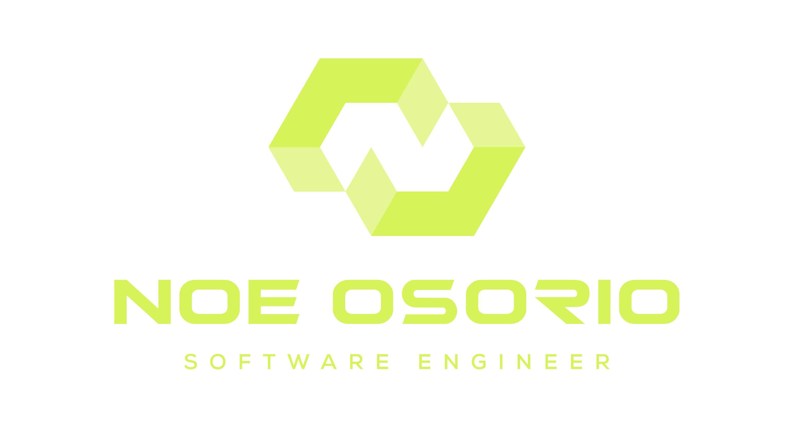
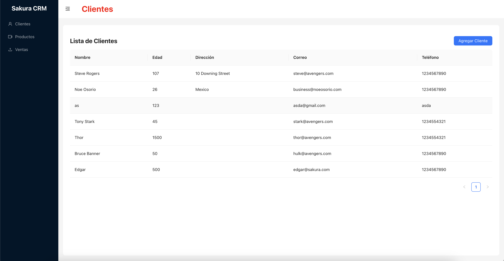
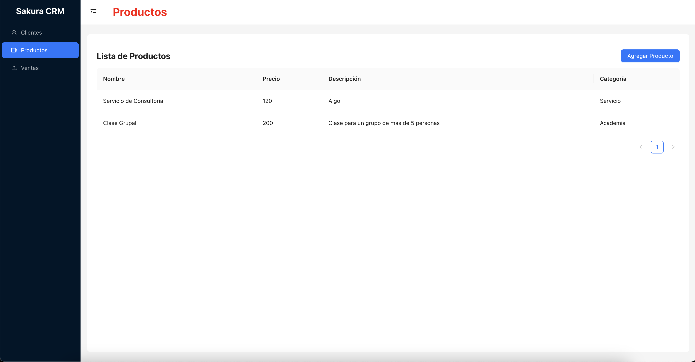
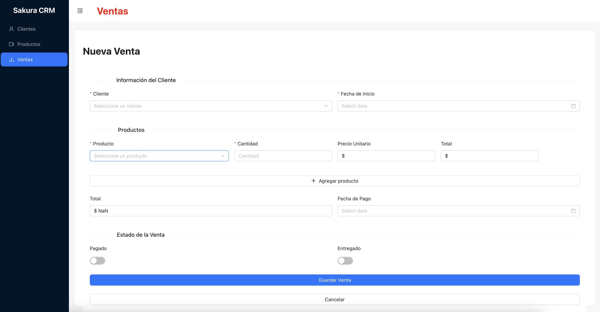

<div align="center">

# CRM Sakura 🌸


Un sistema de gestión de relaciones con clientes (CRM) desarrollado bajo la marca **Sakura Academy**.



</div>

## 🚀 Descripción

**CRM Sakura** es una aplicación web diseñada para ayudar a las empresas a gestionar de manera eficiente sus relaciones con clientes, centralizando información de contacto, historial de interacciones y oportunidades de ventas en una única plataforma.

## 🌟 Características

- **Gestión de Contactos**: Almacena y organiza la información de tus clientes.
- **Historial de Interacciones**: Registra todas las interacciones con cada cliente.
- **Oportunidades de Venta**: Gestiona y sigue el progreso de las oportunidades de ventas.
- **Panel de Control**: Visualiza estadísticas y métricas clave en un panel de control interactivo.

## 📸 Capturas de Pantalla





## 💻 Tecnologías Utilizadas

- **React**: Para la interfaz de usuario interactiva y dinámica.


## ⚙️ Configuración del Proyecto

Para configurar y ejecutar este proyecto en tu entorno de desarrollo:

1. Clona el repositorio:
    ```bash
    git clone https://github.com/NoeOsorio/crm-sakura.git
    ```
2. Navega al directorio del proyecto:
    ```bash
    cd crm-sakura
    ```
3. Instala las dependencias necesarias:
    ```bash
    npm install
    ```
4. Configura las variables de entorno en un archivo `.env` basado en el archivo `.env.example`.
5. Inicia el servidor:
    ```bash
    npm start
    ```
6. Accede a la aplicación en tu navegador:
    ```
    http://localhost:3000
    ```

## 📝 Licencia

Este proyecto está licenciado bajo la Licencia MIT. Consulta el archivo [LICENSE](LICENSE) para más detalles.

## 🤝 Contribuir

Si deseas contribuir a este proyecto, te invitamos a realizar un pull request o enviar un correo a [business@noeosorio.com](mailto:business@noeosorio.com).

---

Desarrollado por [Noe Osorio](https://noeosorio.com)
